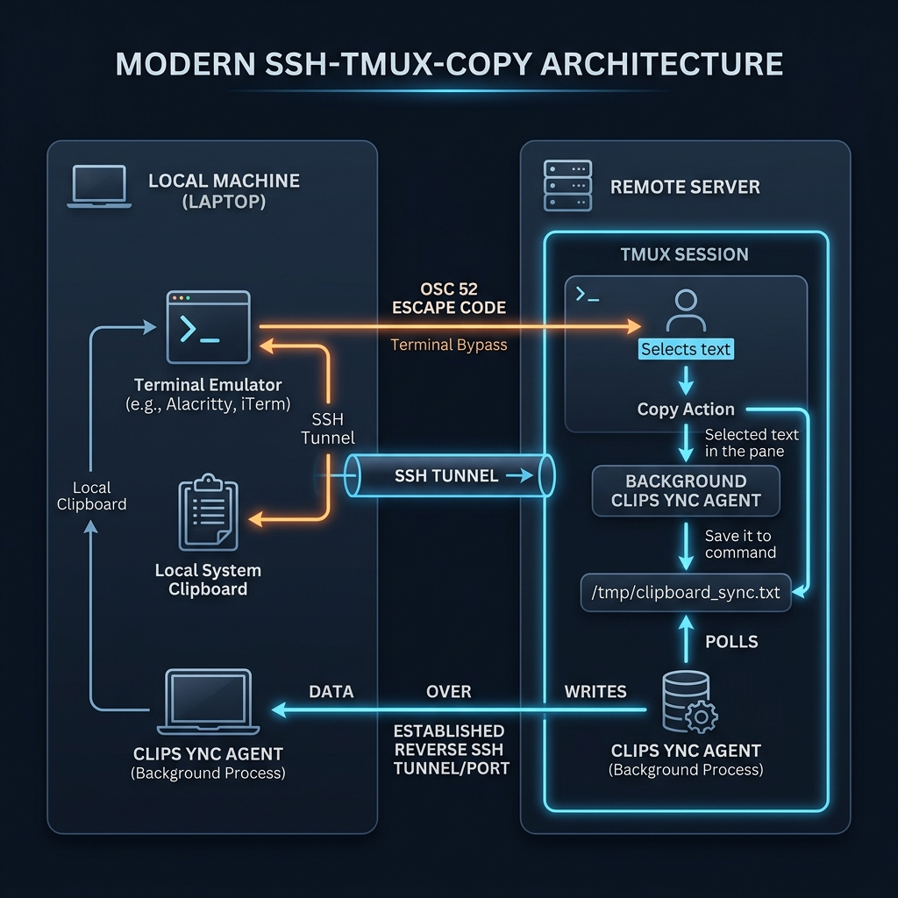
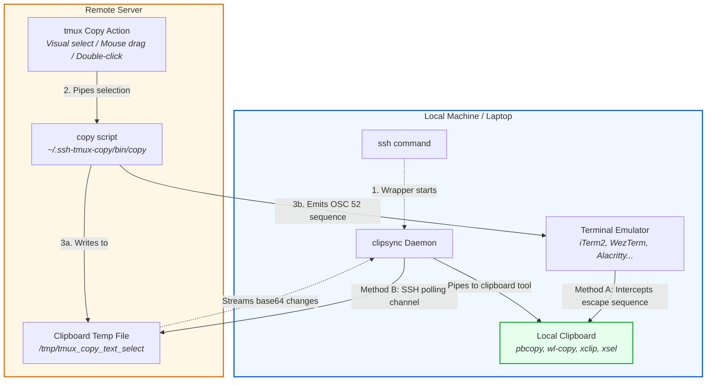

# ssh-tmux-copy

A lightweight, robust utility to synchronize your remote tmux copy selections directly to your local system's clipboard. It supports **OSC 52** out-of-the-box, with a background agent (`clipsync`) fallback for terminals that do not support or block OSC 52.

## Quick Installation

### 1. On your Local Machine (Client/Laptop)
Run this command to install the SSH shell wrapper and `clipsync` daemon:
```bash
curl -fsSL https://raw.githubusercontent.com/anhvth/ssh-tmux-copy/main/install.sh | bash -s -- --local
```

### 2. On the Remote Machine (Server)
Run this command on each remote server to install the tmux configuration and clipboard copy wrapper:
```bash
curl -fsSL https://raw.githubusercontent.com/anhvth/ssh-tmux-copy/main/install.sh | bash -s -- --remote
```
*Note: Reload tmux configuration with `tmux source-file ~/.tmux.conf` (or prefix + `r`) on the remote server after installing.*

---

## Features
- **Zero-config OSC 52:** Directly pipes tmux copy buffers to your terminal emulator's native clipboard interface.
- **Transparent local sync (`clipsync`):** Automatically starts a background agent when you ssh to monitor copies and sync them using your laptop's native clipboard tools (`pbcopy`, `wl-copy`, `xclip`, `xsel`).
- **Standard mouse copy:** Double-click to copy a word, triple-click to copy a line, or click-drag to select text.
- **Vim-style selections:** Normal keybindings like `y` and `Enter` in copy mode sync to the system clipboard automatically.

---

## Troubleshooting
- **Copy does not work over SSH:**
  - Check if your terminal supports OSC 52. If using iTerm2, verify that **Settings → General → Selection → "Applications in terminal may access clipboard"** is checked.
  - If you need the `clipsync` fallback, verify that tmux is installed on your local machine and that your shell wrapper is active by running `clipsync-status`.
- **Old config still active:** Run `tmux kill-server` on the remote host to pick up configuration changes.
- **Select text without copying:** Hold `Shift` while dragging to bypass tmux's mouse handling and use your terminal's native selection.

---

## How It Works

Here is a detailed diagram showing how selections in a remote tmux session are synchronized back to your local machine:

### Architecture Overview


### Data Flow Graph

